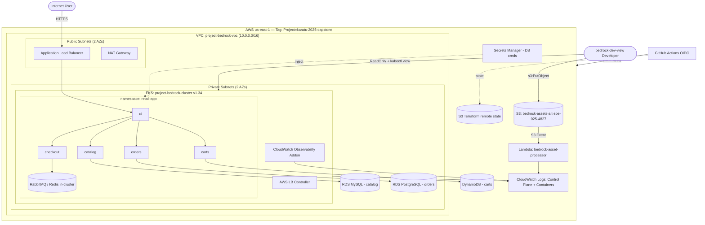

# Project Bedrock — Architecture

InnovateMart's production-grade microservices platform on AWS EKS.

## High-level diagram



## Components

### Networking (`modules/vpc`)
- VPC `project-bedrock-vpc`, CIDR `10.0.0.0/16`.
- Public + private subnets across 2 AZs (`us-east-1a`, `us-east-1b`).
- Single NAT gateway (cost-optimised) for private egress.
- Subnet discovery tags for the AWS Load Balancer Controller.

### Compute (`modules/eks`)
- EKS `project-bedrock-cluster`, Kubernetes v1.34.
- Managed node group (`t3.medium`) in private subnets.
- Control-plane logging (api, audit, authenticator, controllerManager, scheduler) → CloudWatch.
- IRSA/OIDC enabled; AWS Load Balancer Controller installed via Helm.

### Data layer (`modules/data`)
- `catalog` → Amazon RDS **MySQL** (private subnets).
- `orders` → Amazon RDS **PostgreSQL** (private subnets).
- `carts` → Amazon **DynamoDB**.
- Dedicated security groups allow DB ports only from the EKS node security group.
- Credentials generated randomly and stored in **AWS Secrets Manager**.

### Developer access (`modules/iam-developer`)
- IAM user `bedrock-dev-view`.
- AWS console + API: `ReadOnlyAccess` + `s3:PutObject` on the assets bucket.
- Kubernetes: EKS access entry → group bound to the built-in `view` ClusterRole.

### Observability (`modules/observability`)
- Amazon CloudWatch Observability EKS add-on (CloudWatch Agent + Fluent Bit).
- Ships container logs and Container Insights to CloudWatch.

### Serverless (`modules/serverless`)
- Private S3 bucket `bedrock-assets-alt-soe-025-4827`.
- Lambda `bedrock-asset-processor` (Python 3.12) logs uploaded filenames.
- S3 `ObjectCreated` event notification triggers the Lambda.

### State & CI/CD
- Remote state in S3 (`bedrock-tfstate-alt-soe-025-4827`) with native lockfile.
- GitHub Actions: `terraform plan` on PR (commented), `terraform apply` on merge.
- AWS auth via GitHub OIDC role (no static keys in the repo).
```
